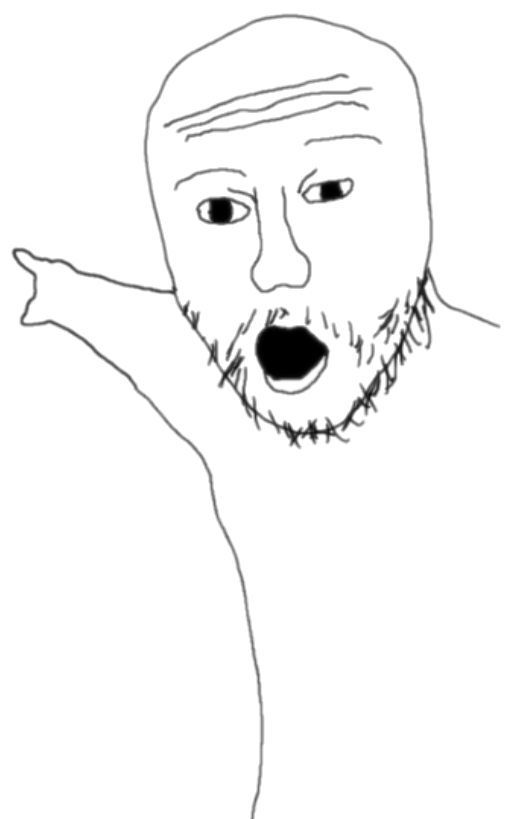

    </img>

  
  
  
  

  

 

<h1 align="center">Wasup, Filipondios Here 🗿</h1>

## About me

</img>

- :telescope: I'm a computer engineer student from Spain (with and without the s)

- 🦀: Actually learning C & Rust, like it should be. 

- :zap: In my free time, I try to make applicattions that make my life easier and then I share that with everyone (Java applicatiions ☕ for now).

- :mailbox:How to reach me: Just send me a dm at my discord: <b>ꜰɪʟɪᴘᴏɴᴅɪᴏꜱ#9621</b>

### :hammer_and_wrench: Languages and Tools :

  &nbsp;
  &nbsp;
  &nbsp;
  &nbsp;
  &nbsp;
  &nbsp;
  &nbsp;
  &nbsp;
  &nbsp;
  &nbsp;
  

 
 ## Stats

---

